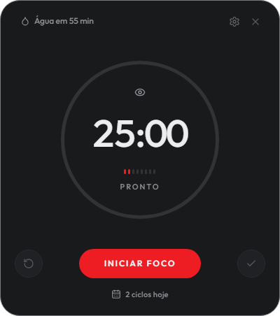
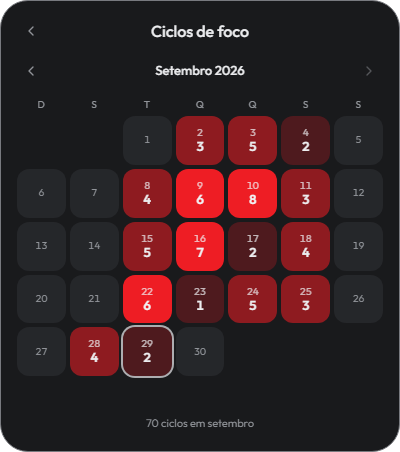

# Cadence — manual de uso

O Cadence dá ritmo ao seu dia de trabalho com **dois relógios que funcionam separados**:

- um **ciclo de foco** de 25 minutos, que você inicia quando quer;
- um **lembrete de água e movimento**, que roda sozinho o dia inteiro.

O segundo não depende do primeiro. Mesmo num dia em que você não usar o cronômetro nenhuma vez, o lembrete de levantar continua chegando.

---

## Instalar

1. Dê **dois cliques** em `Cadence-Setup-0.1.0.exe`.
2. Pronto. Não há perguntas, não há escolha de pasta, e o Windows não pede senha de administrador.

Em cerca de 15 segundos o app instala e abre sozinho.

> **Aviso do Windows na primeira vez.** Como o instalador ainda não tem certificado de assinatura, o Windows pode mostrar uma tela azul dizendo "O Windows protegeu o computador". Clique em **Mais informações** e depois em **Executar assim mesmo**. Isso não volta a acontecer.

Depois de instalado você encontra o Cadence no **Menu Iniciar**, e o ícone fica na **bandeja** (perto do relógio do Windows).

---

## A janela

Da esquerda para a direita, de cima para baixo:

| O que você vê | O que é |
|---|---|
| **Água em 55 min** | O segundo relógio. Clique para dizer que já bebeu e reiniciar a contagem |
| **⚙** | Configurações |
| **✕** | Esconde na bandeja. O app continua rodando |
| **Círculo grande** | O tempo que falta na fase atual. A borda se preenche conforme passa |
| **Tracinhos** | Ciclos que você já concluiu hoje |
| **Palavra embaixo** | Em que fase você está: `PRONTO`, `FOCO`, `PAUSA`, `PAUSA LONGA` |
| **↺** | Zerar — desiste do ciclo atual. **Não conta** |
| **INICIAR** | Começa a fase que está esperando |
| **✓** | Concluir agora — encerra antes do tempo. **Conta** |
| **3 ciclos hoje** | Clique para abrir o calendário |

---

## Usando o ciclo de foco

### Começar

Clique em **INICIAR FOCO** (ou aperte `Espaço`). O círculo começa a contar 25 minutos.

### Enquanto trabalha

- **PAUSAR** congela o cronômetro. Pode ser o telefone, alguém chamando. Retomar continua de onde parou, e **o ciclo não se perde**.
- **✓ Concluir agora** encerra o foco antes do tempo e **conta como ciclo cumprido**. Use quando terminou a tarefa aos 18 minutos.
- **↺ Zerar** desiste. O ciclo **não** é contado.

A diferença entre os dois botões é a intenção: `✓` é *terminei antes*, `↺` é *abandonei*.

### Quando o tempo acaba

O app avisa, toca um som, e deixa a **pausa preparada**.

**Nenhuma fase começa sozinha.** A pausa fica esperando você apertar o botão, e o foco seguinte também. Isso é de propósito: uma pausa que começasse sozinha enquanto você ainda está escrevendo simplesmente passaria, e você teria "descansado" sem sair da cadeira.

### Pausa longa

A cada **4 ciclos concluídos no dia**, a pausa seguinte é de **15 minutos** em vez de 5. O ícone muda para uma poltrona e a tela diz `PAUSA LONGA`.

A contagem é do dia todo, não de quatro seguidos sem parar — e ela zera sozinha à meia-noite.

---

## O lembrete de água e movimento

A cada 55 minutos o Cadence avisa para você beber água e levantar.

- Se você ignorar, ele **repete uma vez** 10 minutos depois.
- Se ignorar de novo, ele se cala até o próximo intervalo. Ele não fica insistindo.
- Para dizer que já cuidou disso, clique em **Água em XX min** no alto da janela, ou clique no aviso que aparece.

**Ele sabe quando você não está.** Se ficar 10 minutos sem mexer no mouse nem no teclado, o lembrete pausa. Quando você volta, a contagem **recomeça do zero** — porque ficar esse tempo longe já foi levantar, que era o pedido dele.

E se o momento do aviso chegar quando você não está na frente do computador, ele espera você voltar em vez de avisar para a cadeira vazia.

---

## O calendário

Clique em **"N ciclos hoje"**, no rodapé da janela.

Cada quadradinho é um dia do mês: o número de cima é o dia, o de baixo é quantos ciclos de foco você concluiu. Quanto mais vermelho, mais ciclos. O dia de hoje tem um contorno claro.

Use as setas para ver outros meses. O total do mês aparece embaixo.

---

## Configurações

Clique no **⚙** ou aperte `Ctrl` + `,`.

Todos os números podem ser **digitados** ou ajustados pelos botões **−** e **+**. As mudanças salvam na hora — não existe botão "Salvar".

### Durações

| Ajuste | Padrão |
|---|---|
| Sessão de foco | 25 min |
| Pausa curta | 5 min |
| Pausa longa | 15 min |

A duração que você mudar vale a partir da **próxima fase que iniciar**. O ciclo que já está correndo não muda no meio.

### Lembretes

| Ajuste | Padrão | Para que serve |
|---|---|---|
| Água e movimento | 55 min | De quanto em quanto tempo o lembrete chega |
| Suspender após inatividade | 10 min | Quanto tempo sem mexer no computador para o app entender que você saiu |
| Som nas notificações | ligado | |
| Som do aviso | Windows | **Windows**, **Sino** (o despertador de cozinha do pomodoro clássico) ou **Suave** |

O som toca quando você escolhe, para poder comparar antes de decidir.

### Geral

- **Tema:** Claro, Escuro ou Sistema. Em "Sistema", o app acompanha o Windows automaticamente.
- **Iniciar com o Windows:** ligado por padrão. O app sobe direto para a bandeja quando o computador liga, sem abrir janela.

---

## O ícone na bandeja

O Cadence fica ao lado do relógio do Windows, mesmo com a janela fechada.

- **Clique esquerdo:** mostra ou esconde a janela.
- **Passe o mouse:** mostra a fase e o tempo que falta.
- **Clique direito:** abre o menu com tudo — iniciar, pausar, zerar, "já bebi água", configurações, iniciar com o Windows e **Sair**.

---

## Atalhos de teclado

| Tecla | O que faz |
|---|---|
| `Espaço` | Inicia, pausa ou retoma |
| `Ctrl` + `,` | Abre as configurações |
| `Esc` | Volta para o cronômetro; no cronômetro, esconde na bandeja |

---

## Dúvidas comuns

**Fechei a janela e o app sumiu.**
Ele não sumiu — foi para a bandeja, perto do relógio do Windows. Clique no ícone para trazer de volta. Fechar a janela **não** para o cronômetro.

**O cronômetro para se eu fechar a janela?**
Não. A contagem acontece por baixo, independente da janela estar aberta.

**Não ouvi o som.**
Confira em Configurações → Lembretes se "Som nas notificações" está ligado (o controle fica **vermelho** quando ligado e cinza quando desligado). Confira também o volume do Windows.

**Deixei o computador ligado a noite toda. Vou acordar com uma pilha de avisos?**
Não. Quando o computador dorme ou fica sem uso, os dois relógios param junto. Nada se acumula.

**Quero parar de vez.**
Clique direito no ícone da bandeja → **Sair**.

**Quero desinstalar.**
Configurações do Windows → Aplicativos → Cadence → Desinstalar. Suas preferências e seu histórico ficam guardados, caso você instale de novo.

---

## Onde ficam seus dados

Tudo fica só no seu computador. O Cadence não envia nada para lugar nenhum e não precisa de internet.

- Preferências: `%APPDATA%\cadence\settings.json`
- Histórico de ciclos: `%APPDATA%\cadence\history.json`
